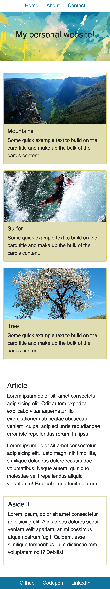

# Sassy Website

Your end goal is to create a mockup website as seen in the [reference image folder](./images_reference).

This page already has a little bit of work done on it, this is a little like when you "inherit" an older project and have to continue from the work of others. You can keep or change any HTML and SCSS you want!

## Instructions

* Run `npm install` in the root directory to download all the necessary dependencies.
* After that, simply use the commnd `npm run start` from the root directory to compile `SCSS` and run the live server automatically.
* The starter code is in the `src` folder. Modify any of the existing files or add new ones as needed.
* Write your styles using `SCSS`. 
* Make use of nesting and variables where possible.
* Make sure to design for mobile first!

## Task 1

The project, as you received it, is using the default Bootstrap colors and fonts.

Specifically, you need to change the `primary` and `secondary` color, and the  base `font family` with these new values:

- primary color: `#0e749e`
- secondary color: `#e0ddb2`

The Bootstrap variables are:

- `$primary`: for the primary color
- `$secondary`: for the secondary color

Add thse variables to a `_variables.scss` file and import it into the existing `main.scss`

**IMPORTANT**: remember that to override the Bootstrap variables, the file needs to be imported before Bootstrap

## Task 2

Continue customising the default Bootstrap variables by changing the base font family and size.

The new values you need to use are:

- base font family: `Helvetica, Arial, sans-serif`
- base font size: `1.25rem`

The Bootstrap variables to change are:

- `$font-family-base`: for the font family 
- `$font-size-base`: for the font size

## Task 3

It's time to customise the 3 cards right after the hero section on top of the page.

You need to change the background color, the border width, and the border color.

The new values to use are:

- card background color: the `secondary` color you added on Task 1
- border color: `#d7d06e`
- border width: `2px`

The Bootstrap variables to override are:

- `$card-bg`: for the card background
- `$card-border-color`: for the border color
- `$card-border-width`: for the border width

## Task 4

You are done customising Bootstrap, but the page still needs some work.

Your task is to keep the top navigation aligned to center up to the large `lg` breakpoint. From the `lg` breakpoint, the navigation should be aligned to the right.

Modify the `index.html` adding the available Bootstrap classes.

Look at the screenshots below for a reference.

## Task 5

You need to add a background image to the `header` at the top of the page.

Make sure that the background occupies the whole space available and that the image has the right aspect ratio at every screen size.

Add your styles to a separate `_style.scss` file and make sure to import it.

## Task 6

After making sure that the background is working correctly, use available Bootstrap classe to center the title in the header both vertically and horizontally.

## Task 7

Back to the card section, the images have different heights.

Add a style to make sure that each image inside of a `card` element has a height of `200px` and make sure that it has the right aspect ratio at any screen size.

## Task 8

Using available Bootstrap classes, add a border to the `aside` element and change its color to the `secondary` color.

After doing that, add classes to both the `article` and the `aside` to add some padding.

## Task 9

Use the available `nav` Bootstrap classes to make the links in the footer to appear like the ones at the top of the page. Make sure they are always centered, at any screen size.

## Task 10

Change the background color of the footer to the `primary` color.

After doing that, change the color of the links in the footer to white.

## Task 11

Using the available Bootstrap classes, add some margin to the containers.

## Task 12

In Bootstrap there's a utility class `vh-100` that sets the height of an element to `100vh`

Create a new class `vh-30` that sets the height to `30vh`. Add this class to the `header`.

## Reference

* Use the images in the [images folder](./src/images) for the header and cards.

### Mobile view

### Tablet view

### Desktop view

[//]: # (autograding info start)
#  Results
> ⌛ Give it a minute. As long as you see the orange dot  on top, CodeBuddy is still processing. Refresh this page to see it's current status.
>
> This is what CodeBuddy found when running your code. It is to show you what you have achieved and to give you hints on how to complete the exercise.

### Sass

|                 Status                  | Check                                                                                    |
| :-------------------------------------: | :--------------------------------------------------------------------------------------- |
|  | SCSS should be compiled into CSS in the file `/src/styles/main.css` |

### Navigation

|                 Status                  | Check                                                                                    |
| :-------------------------------------: | :--------------------------------------------------------------------------------------- |
|  | Link tags in `nav` should use the text color `#016690` |

### Cards

|                 Status                  | Check                                                                                    |
| :-------------------------------------: | :--------------------------------------------------------------------------------------- |
|  | `.card` should have background color `#e0ddb2` |

### Cards and aside

|                 Status                  | Check                                                                                    |
| :-------------------------------------: | :--------------------------------------------------------------------------------------- |
|  | `.card` should have border color `#dad6ab` |
|  | `aside` should have border color `#dad6ab` |

### Images

|                 Status                  | Check                                                                                    |
| :-------------------------------------: | :--------------------------------------------------------------------------------------- |
|  | Page should use the background images provided in the `src/images` folder |

### Responsivity

|                 Status                  | Check                                                                                    |
| :-------------------------------------: | :--------------------------------------------------------------------------------------- |
|  | On 768px Breakpoint and and above `.card` should have its `width` property set to `80%` |
|  | On 1025px Breakpoint and and above `.cards` container should have its `justify-content` property set to `center` |

[🔬 Results Details](../../actions)
[🐞 Tips on Debugging](https://github.com/DCI-EdTech/autograding-setup/wiki/How-to-work-with-CodeBuddy)
[📢 Report Problem](https://docs.google.com/forms/d/e/1FAIpQLSfS8wPh6bCMTLF2wmjiE5_UhPiOEnubEwwPLN_M8zTCjx5qbg/viewform?usp=pp_url&entry.652569746=UIB-framework-variables)

[//]: # (autograding info end)